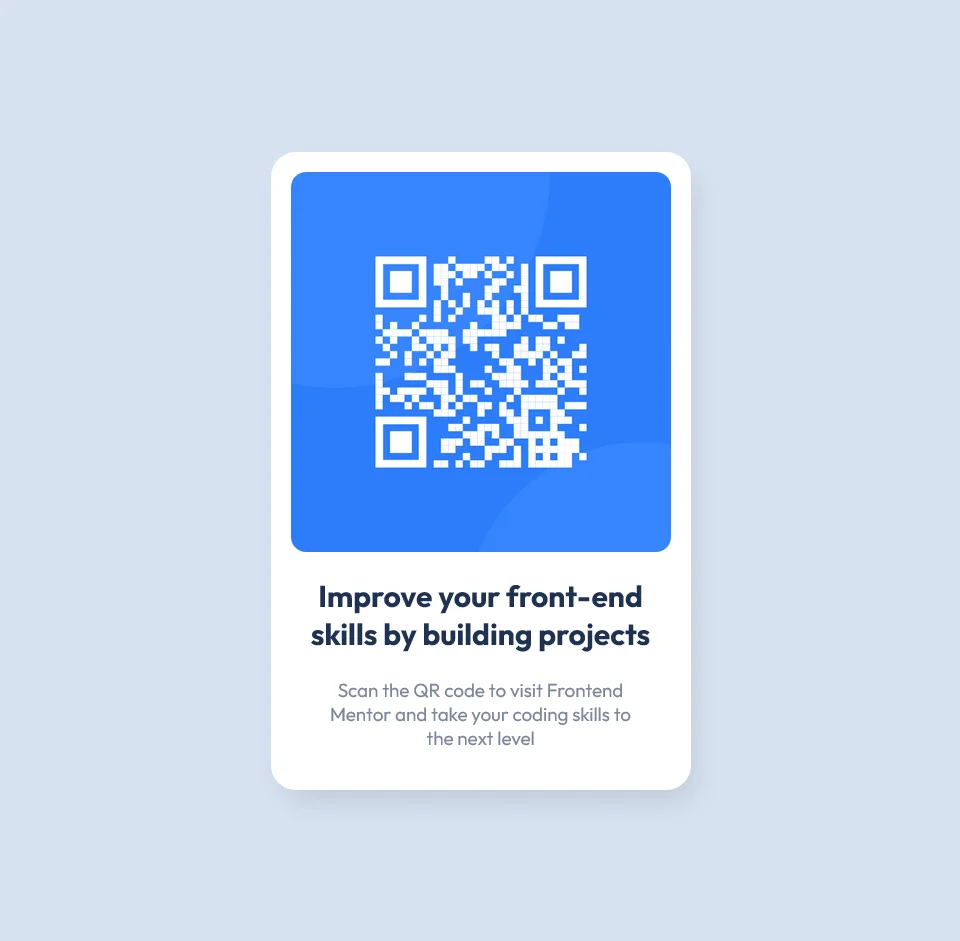

# Frontend Mentor - QR code component solution

This is my solution to the [QR code component challenge on Frontend Mentor](https://www.frontendmentor.io/challenges/qr-code-component-iux_sIO_H). Frontend Mentor challenges help you improve your coding skills by building realistic projects.

## Overview

### Screenshot

### Links

- Solution URL: [Github Repo](https://github.com/devmor-j/fm-qr-code-component)
- Live Site URL: [Github Pages](https://devmor-j.github.io/fm-qr-code-component/)

### Built with

- Semantic HTML5 markup
- Self-hosting CSS fonts
- Minimal Flexbox usage
- One layer of CSS box-shadow
- Mobile-first workflow
